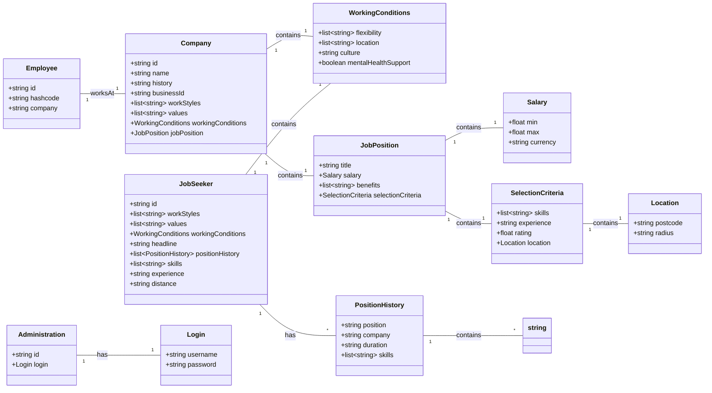

# Users Data model (initial version)




# Job Matching Analysis with Google NLU

This diagram represents the relationships between job seekers and their job matches based on the company's job postings and the match percentages.

## Mermaid Diagram of Job Seekers and Matches

```mermaid
classDiagram
    direction LR
    
    class JobSeeker {
        +string jobSeekerId
        +string jobSeeker
        +list~Match~ matches
    }
    
    class Match {
        +string companyName
        +string jobPost
        +string matchPercentage
    }

    JobSeeker "1" -- "*" Match : has
    
    %% Data sample for JS22345
    JobSeeker : "JS22345"
    JobSeeker : "Junior Data Scientist"
    Match : "CompanyName | Software Development Technical Lead | 33.33"
    Match : "TechInnovators | Data Scientist | 63.64"
    Match : "HealthTech Corp | Healthcare Product Manager | 33.33"
    Match : "GreenTech Solutions | Environmental Engineer | 33.33"
    Match : "FinServe Ltd. | Financial Analyst | 33.33"

    %% Data sample for JS12345
    JobSeeker : "JS12345"
    JobSeeker : "Experienced Full Stack Developer"
    Match : "CompanyName | Software Development Technical Lead | 100.00"
    Match : "TechInnovators | Data Scientist | 27.27"
    Match : "HealthTech Corp | Healthcare Product Manager | 63.64"
    Match : "GreenTech Solutions | Environmental Engineer | 27.27"
    Match : "FinServe Ltd. | Financial Analyst | 27.27"

    %% Data sample for JS67890
    JobSeeker : "JS67890"
    JobSeeker : "Senior Software Engineer"
    Match : "CompanyName | Software Development Technical Lead | 66.67"
    Match : "TechInnovators | Data Scientist | 27.27"
    Match : "HealthTech Corp | Healthcare Product Manager | 33.33"
    Match : "GreenTech Solutions | Environmental Engineer | 33.33"
    Match : "FinServe Ltd. | Financial Analyst | 33.33"

    %% Data sample for JS33456
    JobSeeker : "JS33456"
    JobSeeker : "Project Manager"
    Match : "CompanyName | Software Development Technical Lead | 41.67"
    Match : "TechInnovators | Data Scientist | 0.00"
    Match : "HealthTech Corp | Healthcare Product Manager | 66.67"
    Match : "GreenTech Solutions | Environmental Engineer | 8.33"
    Match : "FinServe Ltd. | Financial Analyst | 33.33"

    %% Data sample for JS44567
    JobSeeker : "JS44567"
    JobSeeker : "Marketing Specialist"
    Match : "CompanyName | Software Development Technical Lead | 33.33"
    Match : "TechInnovators | Data Scientist | 63.64"
    Match : "HealthTech Corp | Healthcare Product Manager | 33.33"
    Match : "GreenTech Solutions | Environmental Engineer | 66.67"
    Match : "FinServe Ltd. | Financial Analyst | 66.67"
