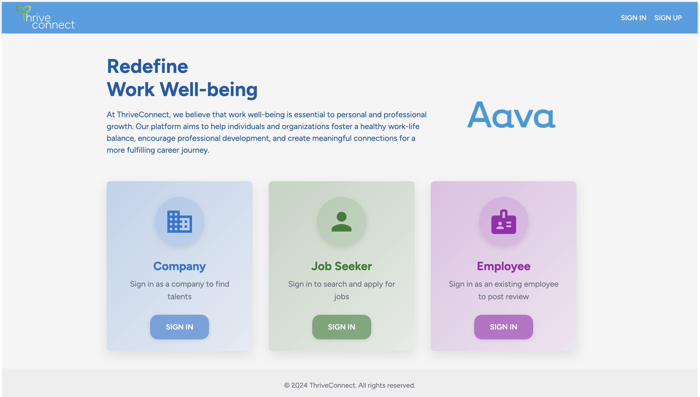
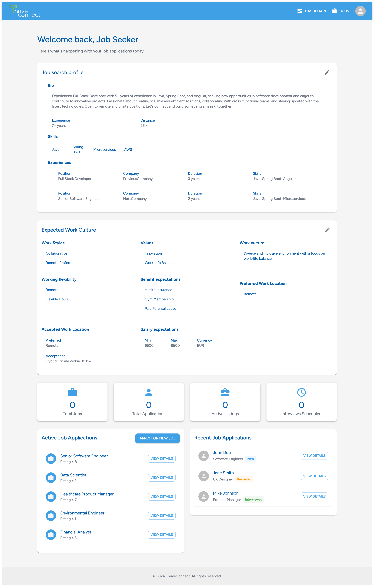
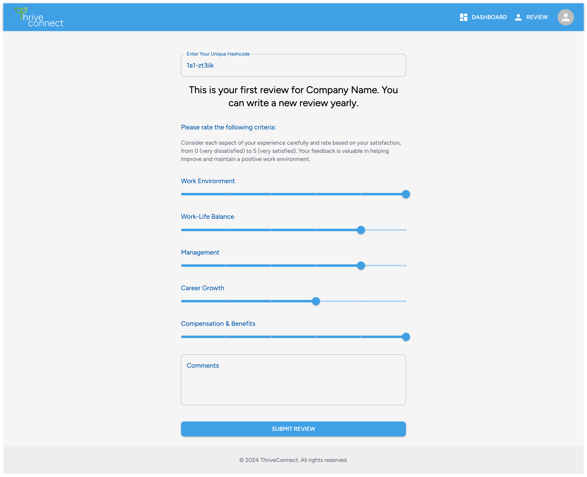
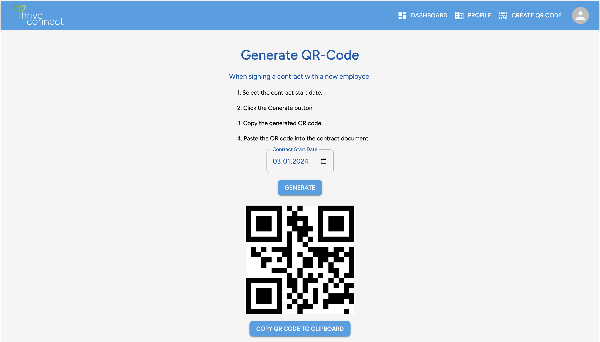
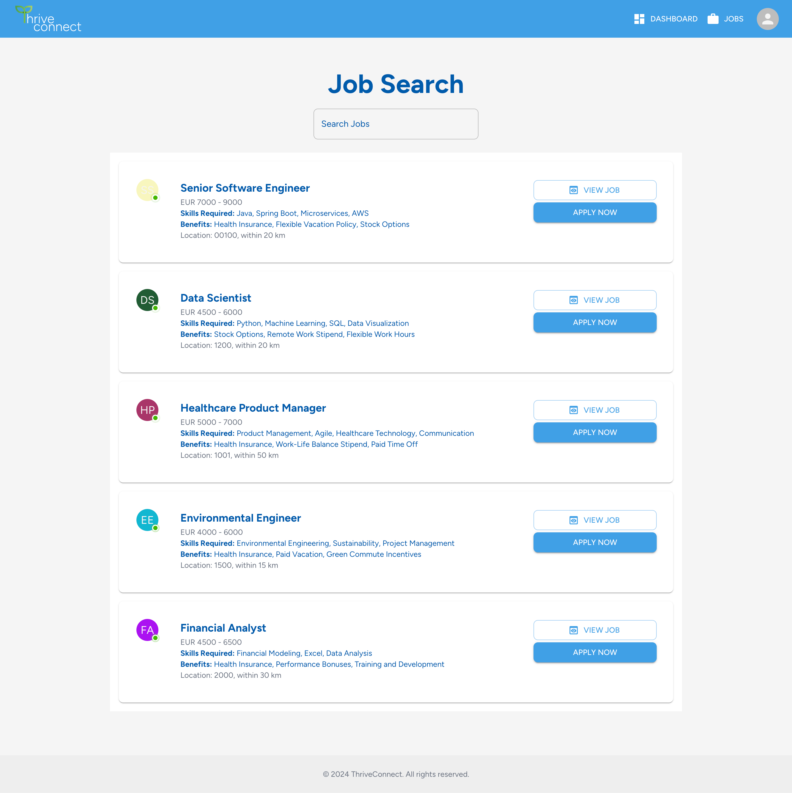
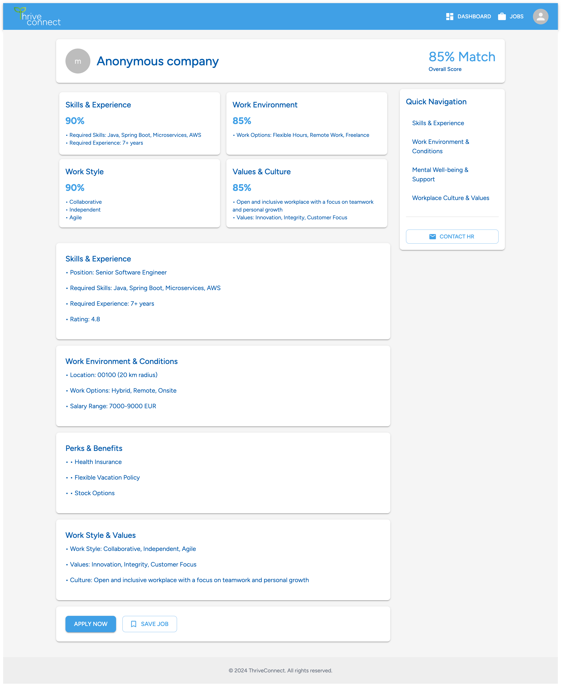
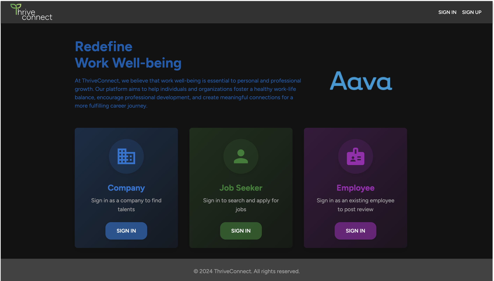

# Junction_2024_Challenge: ThriveConnect
This is a challenge project for Junction Hackathon 2024 - Going Offline. The topic is ThriveConnect: Redefine Work Well-being

## The challenge
Your mission is to create an app where employees can discover job opportunities that align with their personal values, work styles, and mental well-being needs. Both employees and companies will create anonymous profiles, which are matched based on shared priorities like mental health support, flexible working conditions, and workplace culture.

This app will also analyze data on company performance, covering diversity efforts, community engagement, and mental health initiatives, ensuring employees find workplaces that genuinely support their well-being. A key challenge is ensuring transparency and trust—how can we ensure that reviews left on companies are fair and authentic, not biased by HR departments or disgruntled former employees?

The goal behind this app is clear: we want to help companies understand that they can change their structures and culture to become mentally sustainable workplaces. Creating an app that reveals the true atmosphere within a company can apply positive pressure for change, driving businesses to take mental health seriously. We want to lead the conversation on how companies must take responsibility for their employees’ mental health and well-being.

You can leverage various sources to understand which skills and cultural aspects are appreciated in modern workplaces. Let’s connect the dots between company culture and employee competencies.

## Functions:
- Main user: 
  - Job Seekers: talents who visit the platform to look for the most awesome companies and job positions
  - Companies: employer will fill in their companies profiles and match with the best talents
  - Employee: Current employee will leave review for their company to benefits their future job search and help out fellow job seekers
<!-- -  -->

## Technologies used
Languages:
- JavaScript

Libraries and frameworks:

- React
- json-server
- Material UI
- Redux

## Setup and usage

<!-- **Live page [here](https://alextran.dev)** -->

**To host project locally**
- Clone the project: ```git clone https://github.com/alextrandev/junction_2024_challenge.git```
- Change working directory ```cd junction_2024_challenge```
- Install dependencies ```npm install```
- Serve json-server in local host ```npm run start-json```
- Serve project in local host ```npm run dev```

## Screenshot
**Homepage**


**Job Seeker profile**
Here Job Seeker can fill out their preferred working condition, their values and share why they qualified for the best job positions


**Employee review**
Current employees can review their company work environment / culture to benefits their future job search and help out fellow job seekers

QR Hash system is implemented to ensure the transparency and honesty of reviews


**Job match**
Job opotunities are offered based on profile matching which takes into account values, work ethics, work cultures, flexibity

The Job search processes are entirely anonymous. Job seekers will not have to be worry about their sex, ethnicity, age, etc. Companies can keep their trategy ans secret safe.


**Dark mode suppported**


## Authors and acknowledgment

- Thanks [Junction](https://www.hackjunction.com/) 2024 crews and organizer for the wonderful event.
- Thanks Junction's partner [Aava](https://www.aava.fi/) for the wonderful challenge and all the help from booth team.
